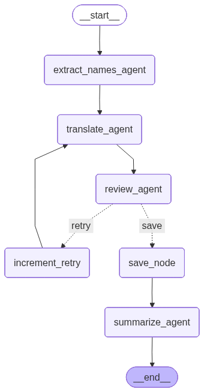

# Pisces API - Translation Multi-Agent System

Backend engine for the Pisces translation application, featuring a LangGraph-powered multi-agent architecture to automate the translation of Chinese literature into high-quality Vietnamese (VietPhrase style).

## 🏗️ Architecture: Multi-Agent Pipeline

The core intelligence of this system lies in its deterministic state graph, orchestrating specialized Large Language Model (LLM) agents. The pipeline handles everything proactively—from extracting complex context out of raw text to quality assurance loops, eventually outputting polished chapters.



### The Agents

Located inside `app/agents/`, these modular components embody distinct responsibilities within the workflow:

1. **🏷️ Extract Names Agent (`extract_names_agent.py`)** 
   - **Role:** Extracts key entities such as characters, locations, sects, and proper nouns from the raw Chinese text before translation occurs.
   - **Impact:** Guarantees terminology consistency throughout a chapter.

2. **🌐 Translate Agent (`translate_agent.py`)**
   - **Role:** Performs direct Chinese-to-Vietnamese translation strictly abiding by hardcoded prompt guidelines (found in `app/prompts/translate_vietnamese.yaml`).
   - **Impact:** Maintains the grammatical flavor of standard Vietnamese web novel conventions while integrating extracted context (names) and plot context (previous summaries).

3. **🕵️ Review Agent (`review_agent.py`)**
   - **Role:** Acts as an automated editor. Cross-references the translation against the original syntax for quality, fidelity, and tone.
   - **Impact:** Triggers a conditional outcome: `Verdict.PASS` allows the sequence to finalize, whereas `Verdict.FAIL` prompts a localized retry execution block—meaning the system will loop back to the *Translate Agent* with appended feedback mechanisms (up to a defined `max_retries`).

4. **📝 Summarize Agent (`summarize_agent.py`)**
   - **Role:** Once a translation passes inspection and saves, this agent digests the chapter into an ongoing context log.
   - **Impact:** It sets the `current_summary` which serves as the memory blueprint (`previous_summary`) for the very next chapter running through the pipeline. 

### LangGraph Orchestration (`app/graph`)

The magic linking these components resides within the graph directory:
- **`pipeline.py`**: Defines the physical `StateGraph`. This file explicitly maps node-to-node transfers, like attaching the `_route_after_review` intelligence to branch between save-actions versus increment-retry actions.
- **`state.py`**: Declares `ChapterState`, a highly typed dictionary structure that acts as the shared, mutating memory cache passed around globally through all node executions.

### Typed Validations (`app/schemas`)

Predictability is maintained via strictly enforced Pydantic structures. 
The system defines separate schema namespaces (`app/schemas/graph/`) ensuring that the LLMs outputs adhere perfectly to the expected models, such as `NamesExtractionResult`, `ReviewResult`, and `TranslateResult`. Failure to decode into these schemas throws programmatic exceptions instead of silent hallucinated text.

## 🛠️ Project Structure Overview
```text
pisces-api/
├── app/
│   ├── agents/     # LangChain Agent logic (translate, review, summarize)
│   ├── core/       # Foundational configs (LLM client setup, logging)
│   ├── graph/      # LangGraph configuration (state management, routing)
│   ├── prompts/    # Prompt engineering stored cleanly in YAML configurations
│   └── schemas/    # Pydantic typing separations (app-level vs. graph-level)
├── pipeline.mmd    # Architecture mermaid diagrams
└── main.py         # Main entry point & FastAPI application context
```
